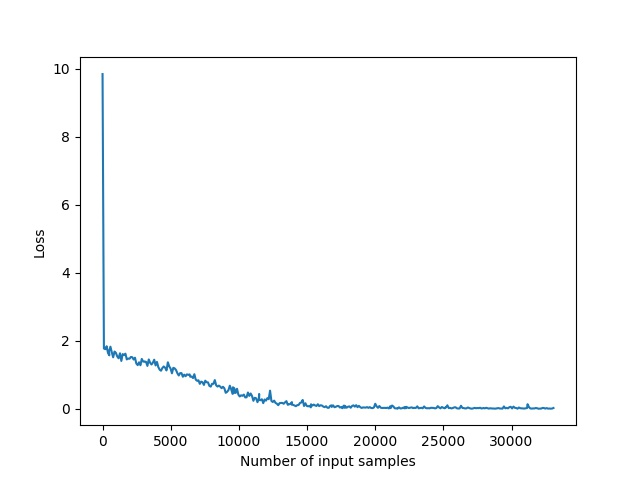
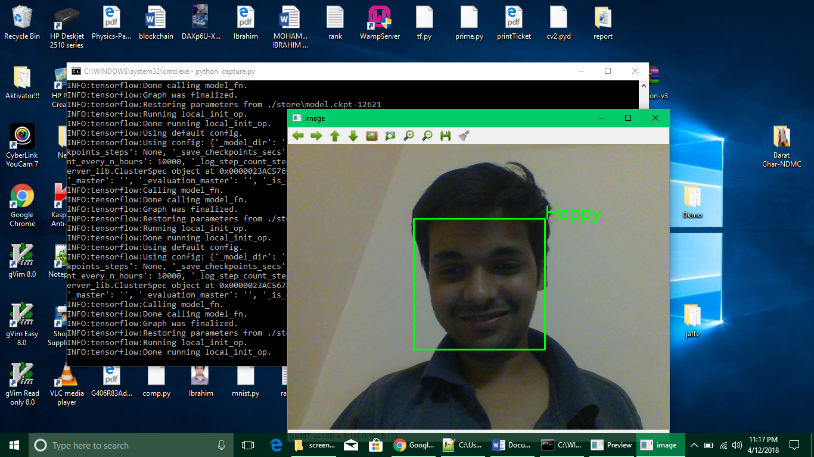
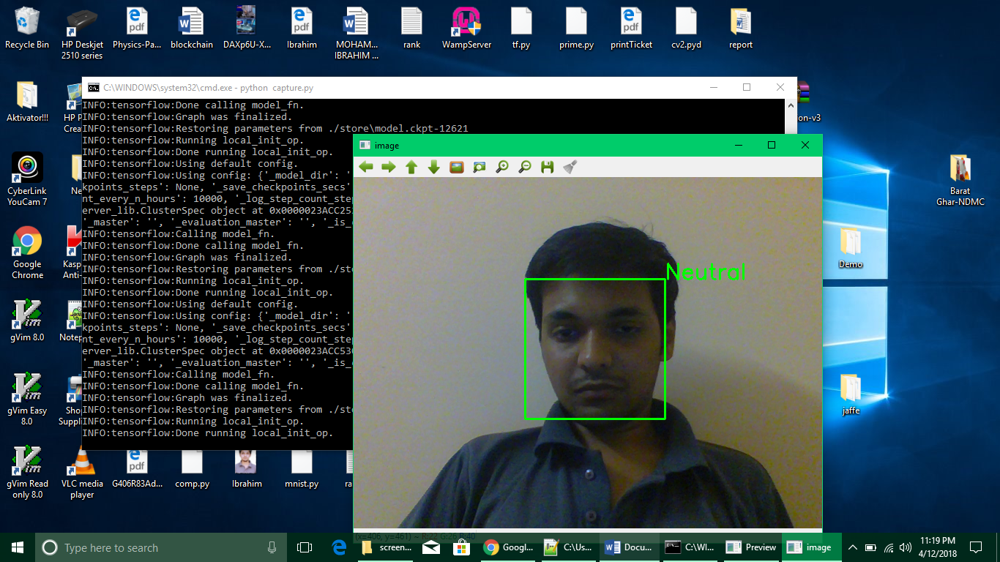

In order to train a system that learns to recognize emotions from images of facial expressions, we need a large dataset of sample images and their corresponding images. A good example of such a dataset is the Facial Expression Recognition (FER) dataset. It can be downloaded from the following url:

https://www.kaggle.com/c/challenges-in-representation-learning-facial-expression-recognition-challenge/data

We develop a Convolutional Neural Network (CNN) and train it on the dataset. I have used a smaller version of a popular CNN architecture called ResNet, proposed in the following paper:

https://arxiv.org/abs/1512.03385

The architecture I used is adapted from Resnet18 but consists of 14 layers.

Now, all the training images from the dataset are trained on this network and the network's parameters (weights and biases) are updated using Gradient Descent. The error/loss function decreases with the number of training iterations as illustrated in the graph below:

After we train the network, we check its accuracy on the test dataset. In this network the accuracy turned out to be 63% which is not that great but still satisfactory considering the size of the network, difficulty of the task and relatively minute differences among some emotions.

Now, this trained network can be deployed in softwares and devices to provide a variety of practical solutions. It yielded some pretty promising results when I deployed it on real time webcam feed.

